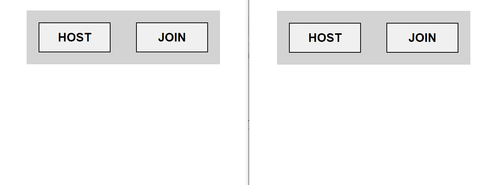

# p2p-game-poc
HTML5 Multiplayer p2p (WebRTC) demo: phaser 3 as game engine + planck.js as physics engine

## Features

This is a proof of concept to see the feasibility of creating p2p HTML5 multiplayer games on a mesh network.

The communication between the browsers is done through WebRTC.

The signaling is done with deepstream.io or firebase (even with the LocalStorage during development).

Comment and uncomment the lines of the index.html to establish the desired signaling:

```js
<!-- localstorage signaling (only for localhost)-->
<script src="./signaling-localstorage.js" defer></script>

<!-- firebase signaling -->
<script src="https://www.gstatic.com/firebasejs/8.2.3/firebase-app.js" defer></script>
<script src="https://www.gstatic.com/firebasejs/8.2.3/firebase-firestore.js" defer></script>
<script src="https://unpkg.com/mplaynet@latest/dist/mplaynet-firebase.umd.min.js" defer></script>
<script src="./signaling-firebase.js" defer></script>

<!-- deepstream.io signaling -->
<script src="//cdn.jsdelivr.net/npm/@deepstream/client@5.1.10/dist/bundle/ds.min.js" defer></script>
<script src="https://unpkg.com/mplaynet@latest/dist/mplaynet-deepstream.umd.min.js" defer></script>
<script src="./signaling-deepstream.js" defer></script>
```
If you choose deepstream or firebase, fill in the connection details in signaling-deepstream.js or in signaling-firebase.js

All the management of the mesh network (signaling, connections, sending / receiving messages) is encapsulated into [mplaynet](https://github.com/supertorpe/mplaynet).

Once the signaling has finished and the connections have been established, all traffic goes directly between the browsers.

The peers are synchronized and agree on the game start time.

Once the game starts, the time is divided into slices (e.g. 100ms).

Each peer broadcast its commands -its keystrokes-, indicating the slice to which they belong. As the commands of the other players arrive from the network, they are stored in a buffer.

Each slice corresponds to a game state (world and objects from planckjs, scoreboard and commands -local and remote-).
Before calculating the next game state, the command buffer is traversed to assign them to the corresponding game state.

To calculate the next game state, It clones the current game state and physics is calculated applying the commands.

A list of the n-last slices is stored in memory.

If commands arrive from a slice prior to the current one, the history of the game states is recalculated from that slice on. Thus, all peers keep game state synchronized, despite latency.

You can configure the slice that is rendered. If it is not the latest, the rendering can interpolate between the current state and the next.

If you change the tab or minimize the browser, the gameloop stops, but the commands continue to be received over the network. When you reactivate the tab, the history of the game states of that lost period is reconstructed, thereby resynchronizing the game.

When I need to generate random numbers, I use a pseudo-random algorithm with seeds (Mersenne Twister), in such a way that all pairs generate the same numbers each time.
I keep these numbers in an array in case I have to rewrite the history of the game states, recover the ones that were generated at the time.

## MultiplayerScene

The logic of game state management, history rewriting, etc. it is encapsulated in the MultiplayerScene class.

The GameStates contain meta information such as the slice, planck world and bodies... and an "info" field that is left open so that the scene includes what it needs (e.g. scores).

The logic of the game is implemented in a class which inherits from MultiplayerScene.

Considerations for scenes inheriting from MultiplayerScene:

They must implement the methods:

- **constructor(peers, mesh, timeToStart)**: it must receive the array of peers, the mesh network and the future timestamp in which we want the game to start

- **sceneCreate()**: Here you write everything you would do in your "create ()".

Further, we must:
    - Associate Phaser object to Planck object: **planckObject.setUserData(phaserObject);**
    - Phaser objects for which we want interpolation: **phaserObject.interpolate = true;**
    - Planck objects that correspond to the character of a peer: **planckObject.peerIndex = peerIndex;**
    - return an object **{ world: _planck_world_, info: _extra_info_, }** where _extra_info_ is the info we want to store into the game state not related to planck bodies, like scores... 

- **newGameState(prevState, newState, rewritingHistory)**: invoked when a new game state is being created, before calculating the physics.

Here it would be necessary to hook the colliders and perform treatment that depends exclusively on the previous state. The last parameter indicates whether it is being invoked within the history rewrite loop.

- **computePhysics(body, command)**: here you have to apply the physics to the body depending on the command

- **readCommand()**: reads the input method (e.g. keyboard) to generate and return a numeric value that represents it.
Special value 0 is "no command"

- **render(gameState)**: rendering of phaser objects associated with planck objects is automatic. The rest of the elements are rendered here (e.g. scores)

- **cloneGameStateInfo(info)**: clones the game state info that is specific to the scene

## The game

The game is very simple and does not have much value.
The objective is to create the pieces so that it works in p2p multiplayer and that these pieces can be used later in more elaborate games.



[You can play the demo here (in localhost)](https://supertorpe.github.io/p2p-game-poc)